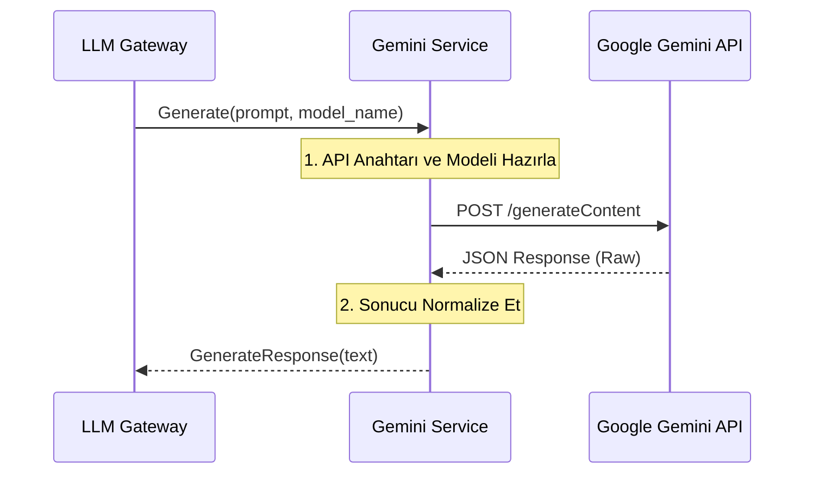

# ✨ Sentiric LLM Gemini Service - Mantık ve Akış Mimarisi

**Stratejik Rol:** Google Gemini API'si ile doğrudan entegrasyonu yönetir. LLM Gateway'den gelen istekleri alır, Gemini formatına çevirir ve Gemini'dan gelen yanıtları normalize ederek Gateway'e döndürür.

---

## 1. Temel Akış: Metin Üretme (Generate)

## 2. API Adaptasyonu
* Bu servis, model adını (gemini-2.0-flash, gemini-2.5-pro) config'den veya doğrudan isteğin model_name alanından alabilir.
* Akış (Streaming): GenerateStream istekleri için kalıcı HTTP bağlantılarını veya sunucu tarafından itilen olayları (SSE) yönetir.